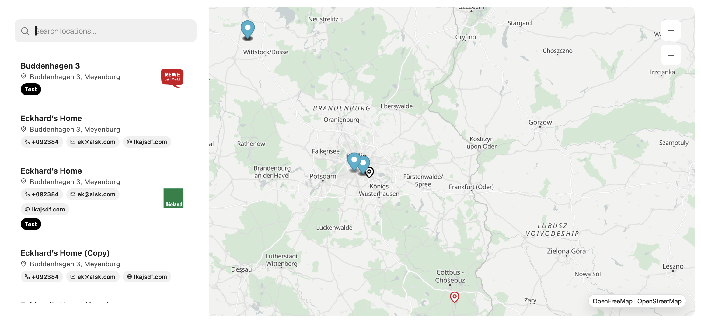

# [`🗺️ minimal-map.net`](https://github.com/emilianscheel/minimal-map.net)

Render a minimalist MapLibre-powered map in Wordpress.



[Demo](https://minimal-map.net/#demo) | [Download](https://github.com/emilianscheel/minimal-map.net/releases/latest/download/minimal-map.zip) | [See Screenshots](Screenshots.md)

## Features

- Open source WordPress map plugin (MIT licensed)
- WordPress-native map plugin built with native WordPress components
- Built-in WordPress admin experience, not a bolted-on SaaS dashboard
- Gutenberg map block for the block editor
- Store locator plugin for WordPress
- Location finder, branch locator, dealer locator, office locator
- Interactive map for business locations, shops, studios, offices, showrooms, events, and directories
- Frontend map powered by MapLibre
- Live block editor map preview
- Dedicated admin workspace for locations, collections, tags, markers, logos, and styles
- **Privacy-first search analytics** with search query trends and metrics
- **Advanced interaction analytics** for location selections and actions (website, email, phone, etc.)
- **Export analytics reports** to CSV for offline reporting
- **GDPR-ready tracking** with built-in **Complianz** script blocking support
- **Marker clustering** to easily handle hundreds of locations on a single map
- **"Find Me" button** for real-time user location centering and distance calculation
- **Live user location "blue dot"** indicator on the map
- Reusable location collections for grouped maps and filtered map views
- Merge location collections to easily consolidate data
- Searchable map with integrated search panel
- Distance-based search results with real-time distance calculation (m/km)
- Automatic nearest-location highlighting in search results
- **Search panel quick filters** like "Open Now" and "By Category" (Tag-based)
- Store locator cards with address, phone, email, website, logo, and tags
- **Social media links** for locations (Instagram, X, Facebook, Threads, YouTube, Telegram)
- Detailed opening hours with support for lunch breaks and seasonal notes
- Real-time "Open Now" status with customizable indicator colors
- **Dynamic opening status hints** like "Opens soon" or "Closes soon"
- Address geocoding for fast location entry
- **Duplicate existing locations** to quickly create similar entries
- **Retrieve coordinates automatically** from addresses (re-geocoding)
- Manual map pin placement and coordinate editing
- **CSV, Excel (XLSX), and JSON import/export** for seamless location data management
- **Custom CSV/Excel/JSON import mapping** for flexible location imports
- **Import opening hours and lunch breaks** from external CSV, Excel, and JSON files
- Example CSV/Excel/JSON export for faster onboarding
- Bulk-friendly location management in a native WordPress admin UI
- **Bulk-assign logos, markers, tags, and opening hours** to multiple locations
- **Power-user keyboard shortcuts** for lightning-fast admin workflows (New: `n`, Merge: `m`)
- Custom SVG logo library for location branding
- Custom marker presets and visual pin styles
- **Individual location pin colors** to override global marker styles per location
- **Bulk-set marker colors** for multiple locations at once
- Multiple map style presets including Liberty, Bright, and Positron
- Custom style themes for map colors and visual branding
- **Custom font family** support to match your site's typography perfectly
- Map theme import from Minimal Map JSON or MapLibre style JSON v8
- **Highly configurable zoom controls** (custom icons, position, and styling)
- Choose from multiple zoom icon sets (plus/minus, circles, lines)
- Configurable search panel colors, spacing, width, and card styling
- **In-map location cards** for modern, overlay-style location details
- Customizable "View on Google Maps" navigation button styling
- Customizable map attribution (credits) styling and positioning
- Collection-based map output for store groups, regions, teams, and categories
- Iframe embed snippet generation for external embeds
- Custom map height controls with mobile-specific height overrides
- Scroll zoom, mobile two-finger zoom, and **cooperative gesture** settings
- English source strings with German and French translations
- Feels native to WordPress and built for modern WordPress sites
- **Marker library** with built-in SVG presets for rapid map styling
- **Pre-built WordPress and static palette templates** for style themes
- **Multi-edit color selection** for map style themes
- **Animated analytics metrics** with relative time labels and event icons
- **Bulk-delete analytics data** for privacy and data management
- **Premium license key support** to unlock advanced features and support

## Development

```bash
bun run dev
bun run build
bun run zip
```

```bash
ln -s "$(pwd)" ~/Studio/my-wordpress-website/wp-content/plugins/minimal-map.net

rm ~/Studio/my-wordpress-website/wp-content/plugins/minimal-map.net
```

```bash
bun run version:bump --major
bun run version:bump --minor
bun run version:bump --patch
```
